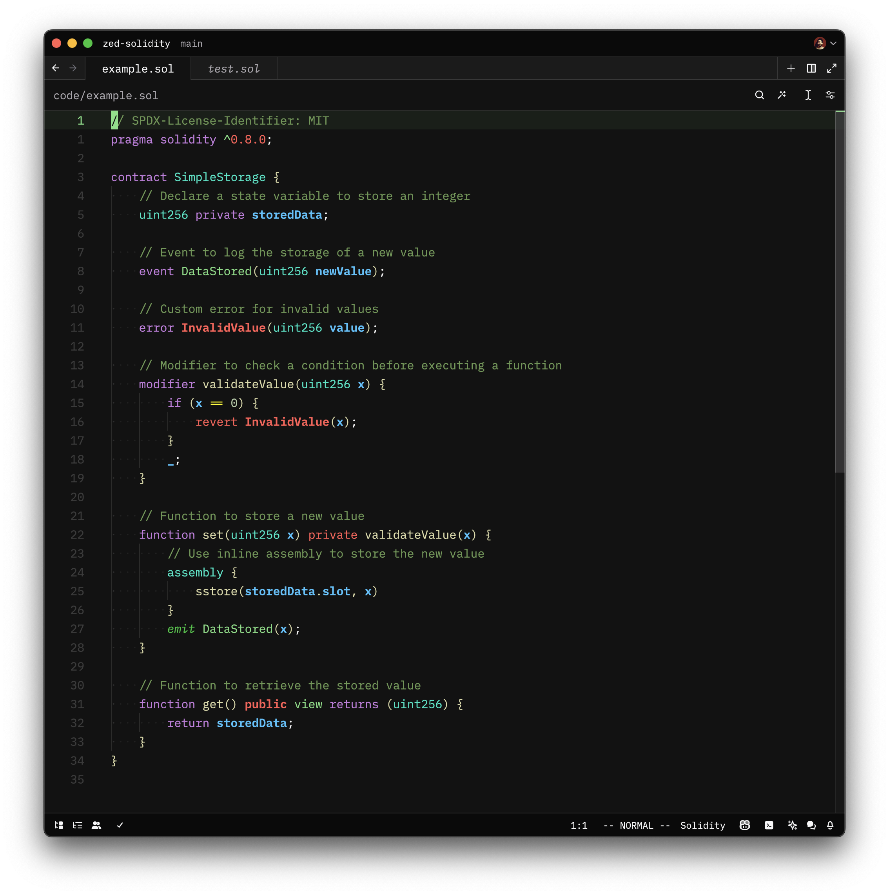

# 💠 Solidity Language Support for Zed

Enhance Zed with Solidity language support, including syntax highlighting and language server features such as diagnostics and more!

- Tree Sitter: [tree-sitter-solidity](https://github.com/JoranHonig/tree-sitter-solidity)
- Language Server: [@nomicfoundation/solidity-language-server](https://github.com/NomicFoundation/hardhat-vscode/tree/main/server)

> [!Tip]
> For the best experience, it is highly recommended to use [XY-Zed](https://github.com/zarifpour/xy-zed). This extension has been built on top of the XY-Zed theme, ensuring that all colors are thoughtfully chosen to provide intelligent syntax highlighting.

---



---

## Tasks

Example tasks for different test frameworks can be found in [.zed/tasks.json](.zed/tasks.json).

How to set up Foundry to run tests via a runnable (the play button next to tests
in the UI) and via keyboard shortcut.

Example task that connect with the definitions in [runnables.scm](languages/solidity/runnables.scm) via tags.
```json
[
  // Individual test.
  {
    "label": "forge test: $ZED_SYMBOL",
    "command": "forge",
    "args": ["test", "--match-test", "$ZED_SYMBOL", "-vvvvv"],
    "tags": ["solidity-test"],
    "reveal": "always",
    "use_new_terminal": false
  },
  // Contract test.
  {
    "label": "forge test: $ZED_SYMBOL (contract)",
    "command": "forge",
    "args": ["test", "--match-contract", "$ZED_SYMBOL", "-vvvvv"],
    "tags": ["solidity-contract-test"],
    "reveal": "always",
    "use_new_terminal": false
  }
]
```

Example keymap to run Forge test for the symbol under the cursor.
```json
[
  {
    "context": "Editor && extension==sol",
    "bindings": {
      "alt-g": ["task::Spawn", { "task_name": "forge test: $ZED_SYMBOL" }]
    }
  }
]
```

## 🛠️ Development Setup

### 1. Clone the repository

```shell
git clone https://github.com/zarifpour/zed-solidity
```

### 2. Uninstall the existing extension

If you have the existing extension installed, you need to uninstall it before installing the development version.

### 3. Load the extension

- Open `zed: extensions`.
- Click `Install Dev Extension`.
- Select the `zed-solidity` directory.

### 4. Rebuild the extension as needed

As you make changes to the extension, you may need to rebuild it. To do so:

- Open `zed: extensions`.
- Click the `Rebuild` button next to the extension.

## 🎸 Contributing

Contributions are welcome!

To contribute:

1. Fork the repo and create a new branch.
2. Make changes and test them.
3. Submit a pull request with a clear description.

Check open issues for areas needing improvement. Thanks for helping improve Solidity support in Zed!

<a href="https://github.com/zarifpour/zed-solidity/graphs/contributors">
  
</a>

## 🏆 Acknowledgments

- [@JoranHonig](https://github.com/JoranHonig) for providing the [tree-sitter-solidity](https://github.com/JoranHonig/tree-sitter-solidity) repository.
- [@meetmangukiya](https://github.com/meetmangukiya) and [@tomholford](https://github.com/tomholford) for inspiration with their PRs to the main Zed repo.

---

<div align=center>

Made with 🩵 by <a href="https://zarifpour.xyz">Daniel Zarifpour</a>

<a href="https://www.buymeacoffee.com/zarifpour"></a>

</div>
